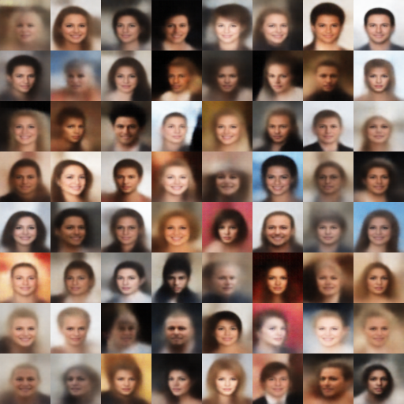

# VAE-Exercise
Implementation for VAE in PyTorch

### Conditional Variational Autoencoder (CVAE)
At first, I was just playing around with VAEs and later attempted facial attribute editing using CVAE. The more I experimented with VAEs, the more I found the tasks of generating images to be intriguing. I learned about various VAE network architectures and studied [AntixK's VAE library](https://github.com/AntixK/PyTorch-VAE) on Github, which inspired me to create my own VAE library. Thus, I decided to use [AntixK's](https://github.com/AntixK) template to develop my own VAE library.

### ToDo List

- [ ] Beta-VAE
- [ ] VQ-VAE

### Done List

- [x] VAE

### Dataset
The model was trained on the CelebA dataset

### Example
#### Sample from Gaussian distribution
| model | example |
| --- | --- |
| VAE |   |

### Code 
| file or folder | description |
| --- | --- |
| dataset.py | Define data loader and data augmentation |
| models | Define class for VAE model contain loss, encoder, decoder and sample |
| predict.py | Load state dict and reconstruct image from latent code |
| run.py | Train network and save best parameter |
| utils.py | Tools for train or infer |
| checkpoints | Best and last checkpoints |
| config | Hyperparameter for project |
| asserts | Saving example for each VAE model |
