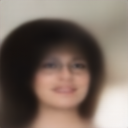
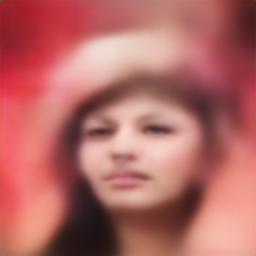
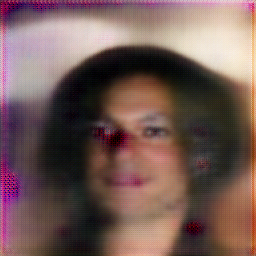
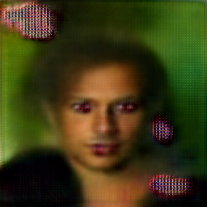
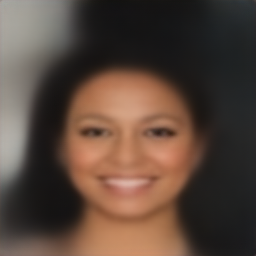
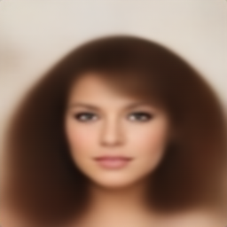

# CVAE-Exercise
Implementation for VAE in PyTorch

### Conditional Variational Autoencoder (CVAE)
This is an implementation of a Conditional Variational Autoencoder (CVAE) using TensorFlow. A CVAE is a type of neural network that is trained to generate new samples from a given set of input conditions. It is a type of generative model that is particularly useful for applications such as image generation, where the model is trained to generate new images based on a set of input conditions, such as image labels.

### ToDo List

- [ ] The quality of the generated faces is not good enough, and we need to improve the quality of the face reconstruction
- [ ] The attribute editing functionality is not yet complete. For example, I can set the male attribute to 1 and it works. But when I set the bald attribute to 1, it doesn't generate a bald person

### Done List

- [x] Completed the generation of handwritten digits using MNIST and the results are not too bad. I used only a fully connected network
- [x] Dealing with the issue that images generated from normal distribution sampling are almost unrecognizable. (The reason is that I set all attribute values to 1, which makes it difficult for CVAE to generate a face that has all the attributes)

### Dependencies
This implementation requires the following dependencies:

Python 3.9
Pytorch
NumPy
opencv-python

### Dataset
The model was trained on the MNIST dataset, which is a dataset of hand-written digits.

### Example
#### Resample From Hidden Feature Example in Validation

#### Resample From Hidden Feature Example

#### Reconstructed From Origin Example

### Code 
| files | description |
| --- | --- |
| Data.py | Download data and define data loader |
| Model.py | Define Conditional Variation AutoEncoder |
| Predict.py | Load state dict and predict specific digit images |
| Train.py | Train network and save best parameter |
| utils.py | Define label2onehot function and others functions |
| FromX-FromZ-8 | Folder for save intermediate image and prediction |
| checkpoints | trained checkpoints |
